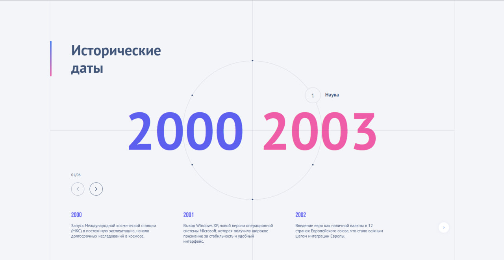
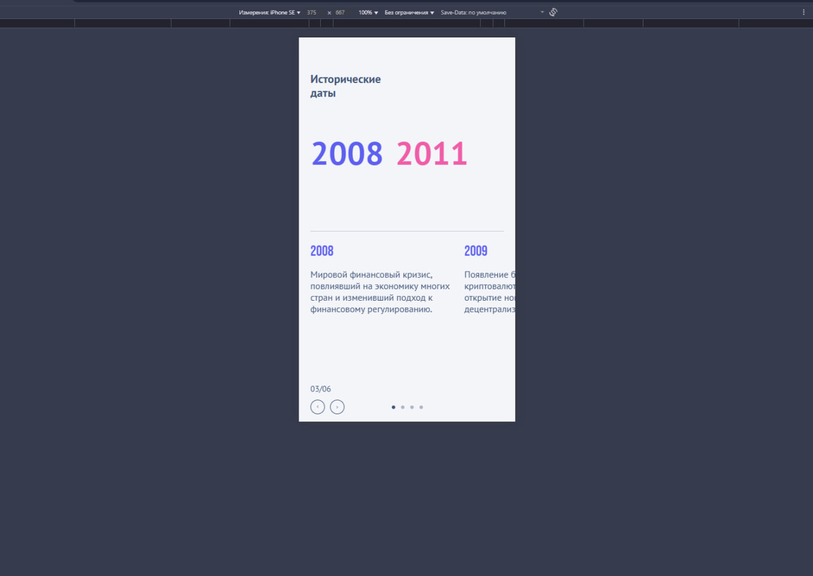

# Timeline Circle Project

Проект представляет собой интерактивный блок с временными отрезками и событиями.

- Визуализируются временные точки на окружности.
- Слайдер показывает подробную информацию по выбранному временно́му отрезку.
- Поддержка от 2 до 6 временных отрезков.
- Полностью независимый и модульный: можно вставить несколько блоков на страницу без конфликта логики.

---

## 📂 Структура проекта


---

## ⚙️ Установка

1. Клонируйте репозиторий:

    ```bash
    git clone https://github.com/kersor/timeline-circle.git
    ```

2. Перейдите в папку проекта:

    ```bash
    cd timeline-circle
    ```

3. Установите зависимости:

    ```bash
    npm install
    ```

---

## 🚀 Запуск проекта

1. Для локальной разработки выполните:

    ```bash
    npm run start
    ```

    Сервер откроется на `http://localhost:3000/`.

2. Для сборки проекта выполните:

    ```bash
    npm run build
    ```
---

## 🛠 Технологии

- **React + TypeScript**  
- **GSAP** — для анимации круга и смены контента  
- **Swiper** — для слайдера событий  
- **SCSS Modules** — стилизация компонентов  

---

## 📌 Особенности реализации

- Использование хуков для изоляции логики:
  - `useResizeRadius` — отслеживает ширину экрана и задаёт радиус круга.
  - `useCirclePositioning` — расставляет точки на окружности.
  - `useCircleRotation` — вращает круг по активному индексу.
  - `useFadeSwitch` — анимация смены слайдов.
  - `useNavigation` — обработка кнопок "назад/вперёд".
- Все компоненты изолированы и могут быть использованы несколько раз на странице.

---

## 📷 Демонстрация работы блока


